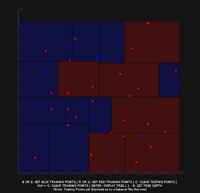
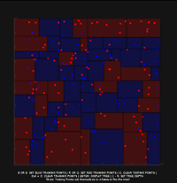

# Decision Tree Visualizer

A little computer science project for decision trees done the day before it was due.

Dynamically training and retraining Decision Tree that predicts how data will be distributed based on training points

Build with Apache Ant by running the "ant" command in the terminal from the project's root directory with Apache Ant installed. A jar file "dist/Decision-Tree-Visualizer.jar" should then appear and be executable.

The program misses a lot of quality of life issues, like erasing points, showing point coordinates, etc.... But I did what I had to do for the grade (•‿•)

